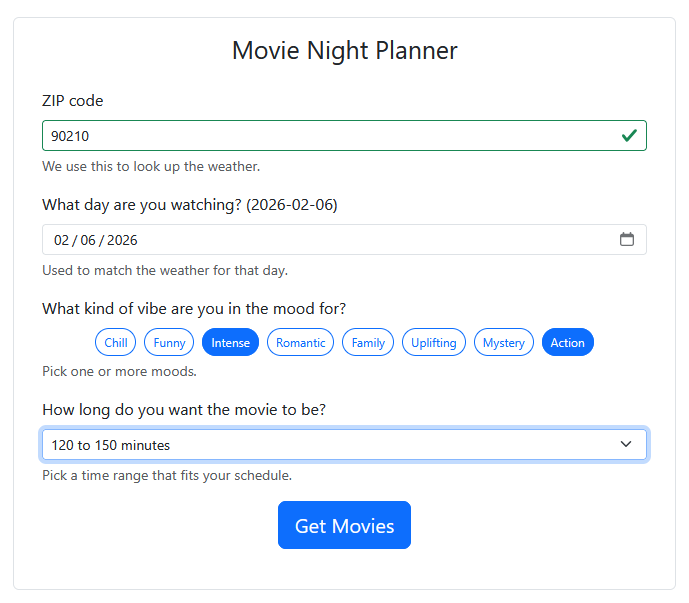
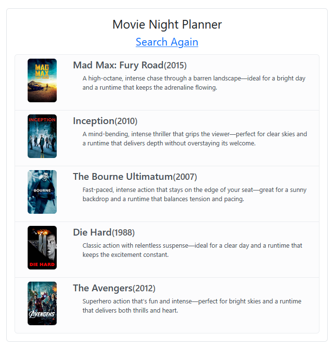

# LV4 Capstone Media Night Picker

## Table of Contents

- [Overview](#overview)
- [Screenshots](#screenshots)
- [Problem Statement](#problem-statement)
- [What It Does](#what-it-does)
- [Project Structure](#project-structure)
- [Architecture Overview](#architecture-overview)
- [Request Flow](#request-flow)
- [Data Model Overview](#data-model-overview)
- [Setup and Run Instructions](#setup-and-run-instructions)
- [Configuration](#configuration)
- [Example Usage](#example-usage)
- [Design Decisions](#design-decisions)
- [Known Limitations](#known-limitations)

## Overview

**LV4 Capstone Media Night Picker** is a full‑stack application built as a Level 4 capstone project.

**This app is for people who want to quickly decide what movie to watch based on mood, available time, and the weather.**

The project combines a React frontend, an Express API backend, two supporting microservices (AI and Weather), and a Supabase PostgreSQL database. It is designed to demonstrate real‑world data flow, API composition, and structured decision logic rather than being a polished consumer product.

## Screenshots

<h2>Search Form</h2>

<p align="center">
  
</p>

<h2>Recommendation Results</h2>

<p align="center">
  
</p>

## Problem Statement

Picking a movie can be surprisingly frustrating. People often know the _vibe_ they want, how much time they have, or whether it feels like a "rainy‑day movie," but they do not want to manually search across multiple apps or remember past picks.

This app solves that by:

- Turning vague preferences into structured inputs
- Using AI to generate recommendations with reasoning
- Persisting those recommendations so the same query does not need to be regenerated

## What It Does

At its current stage, the Media Night Picker can:

- Collect user inputs (ZIP code, date, moods, and length preference)
- Look up weather data for the selected date
- Generate movie recommendations using an AI microservice
- Normalize and store recommendation sets in Supabase
- Detect duplicate recommendation requests using a query signature
- Display results with posters and reasoning

## Project Structure

The repository is organized as multiple related Node and React projects:

```
capstone-mnp-1-frontend/
├── src/
│   ├── components/
│   │   ├── FormFields.jsx
│   │   └── Display.jsx
│   ├── context/
│   ├── utils/
│   ├── assets/
│   └── App.jsx
├── vite.config.js
└── package.json

capstone-mnp-2-backend/
├── src/
│   ├── routes/
│   │   ├── root.js
│   │   └── add.js
│   ├── middleware/
│   ├── utils/
│   └── index.js
└── package.json

capstone-mnp-3-microservice-weather/
├── src/
│   ├── routes/
│   └── utils/
└── package.json

capstone-mnp-4-microservice-ai/
├── src/
│   ├── routes/
│   ├── utils/
│   └── data/
└── package.json
```

Each service runs independently but is designed to work together during a full request flow.

## Architecture Overview

The system follows a service-oriented architecture with clear responsibility boundaries.

```
[ React Frontend ]
        |
        v
[ Weather Microservice ] ----\
        |                     \
        v                      v
[ AI Microservice ] ---> [ Core Backend API ]
                                   |
                                   v
                            [ Supabase Database ]
                                   |
                                   v
                           [ React Frontend ]
```

- The frontend is responsible only for input collection and display
- Microservices handle external concerns (weather and AI)
- The core backend owns validation, normalization, persistence, and logging
- Supabase acts as the system of record

## Setup and Run Instructions

### Prerequisites

- Node.js 18 or newer
- A Supabase project with the expected tables
- API keys for:
  - Supabase
  - Weather provider
  - Hugging Face (AI)

### Frontend

```
cd capstone-mnp-1-frontend
npm install
npm run dev
```

### Backend API

```
cd capstone-mnp-2-backend
npm install
npm run dev
```

### Weather Microservice

```
cd capstone-mnp-3-microservice-weather
npm install
npm run dev
```

### AI Microservice

```
cd capstone-mnp-4-microservice-ai
npm install
npm run dev
```

## Configuration

The project uses environment variables for configuration.

### Frontend

- `VITE_SUPABASE_URL`
- `VITE_SUPABASE_ANON_KEY`

### Backend and Microservices

- `SUPABASE_URL`
- `SUPABASE_SERVICE_ROLE_KEY`
- `HF_TOKEN`
- Weather API key for Visual Crossing

If a variable is missing, the related service will fail at runtime rather than silently degrading.

## Example Usage

1. Start all services
2. Open the frontend in a browser
3. Enter a ZIP code and date
4. Select one or more moods
5. Choose a length bucket
6. Submit the form

Expected result:

- A list of movie recommendations
- Each recommendation includes a reason explaining why it was chosen
- Posters are fetched when available, with a fallback image otherwise

## Request Flow

The request lifecycle is intentionally explicit and traceable across services:

1. **Frontend (React)** collects ZIP code, date, moods, and length bucket
2. **Weather Microservice** is called to retrieve conditions for the selected date and ZIP
3. **AI Microservice** receives normalized inputs and generates movie recommendations with reasoning
4. **Backend API** validates and normalizes the payload, builds a query signature, and checks for duplicates
5. **Database (Supabase)** stores the recommendation set and individual movie records
6. **Frontend (React)** receives the final payload and renders results, including posters and reasoning

This flow makes each responsibility explicit and keeps services loosely coupled.

## Data Model Overview

The core persistence layer revolves around two tables:

### lv4_cap_recommendation_sets

Represents a single recommendation request.

Stored fields include:

- `length_bucket`
- `weather_bucket`
- `moods`
- `prompt_version`
- `variant`
- `query_signature`
- `inputParameters`
- `req_id`

The `query_signature` is a normalized string built from moods, length, weather, prompt version, and variant. It is used to detect duplicate recommendation requests.

### lv4_cap_recommendations

Represents individual movie recommendations belonging to a set.

Stored fields include:

- `set_id` (foreign key to recommendation_sets)
- `title`
- `year`
- `reason`
- `trakt_type`
- `trakt_slug`
- `tmdb_id`
- `imdb_id`

This separation allows a single request to own many recommendations while keeping query metadata isolated.

## Design Decisions

- Services are split by responsibility (frontend, API, weather, AI) to mirror real-world architectures
- Query signatures are generated deterministically to prevent duplicate recommendation sets
- Error handling favors explicit logging over silent failure
- Minimal authentication was chosen to keep focus on data flow and validation
- UI prioritizes clarity and debuggability over visual polish

## Known Limitations

- This project is optimized for learning and demonstration, not production scale
- Authentication and authorization are not hardened
- API rate limiting is not enforced
- AI output quality depends on prompt tuning and model behavior
- No background job or caching layer exists for expensive operations

---

**Project:** LV4 Capstone Media Night Picker

**Author:** Clay Aucoin
